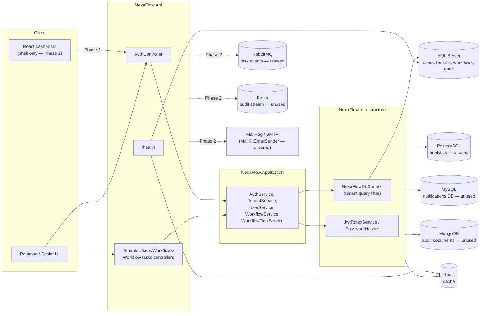

# Architecture overview

## Layering

Clean/onion architecture, dependencies pointing inward:

```
NexaFlow.Domain            entities, enums, repository interfaces — no external deps
   ^
NexaFlow.Application        DTOs, service interfaces + implementations, FluentValidation
   ^
NexaFlow.Infrastructure     EF Core (SQL Server), JWT/BCrypt, repositories
NexaFlow.Messaging          IEventPublisher (NoOp today — Phase 2)
NexaFlow.Notifications      IEmailSender (real SMTP client, unwired — Phase 2)
   ^
NexaFlow.Api                Program.cs wiring, controllers, appsettings
```

`NexaFlow.Tests` references `Domain`/`Application`/`Infrastructure` and runs against EF
Core's InMemory provider — no external services required to run the suite.

## System diagram

Solid lines are implemented and exercised by the test suite / manual smoke tests. Dashed
lines are provisioned (container runs, connection string exists) but not yet consumed by
any code path — see [ADR-001](adr/001-database-strategy.md) and
[ADR-002](adr/002-messaging-choice.md) for why.



## Multi-tenancy

Every tenant-scoped entity (`User`, `Workflow`, `WorkflowTask`, `Notification`,
`AuditLog`) implements `ITenantScoped`. `NexaFlowDbContext` applies an EF Core global
query filter per entity:

```csharp
modelBuilder.Entity<Workflow>().HasQueryFilter(e =>
    !currentUserService.TenantId.HasValue || e.TenantId == currentUserService.TenantId);
```

`ICurrentUserService.TenantId` comes from the JWT `tenant_id` claim. When there's no
authenticated caller (registration, login-by-email lookup) the filter is a no-op rather
than "match nothing" — otherwise duplicate-email checks and login could never find an
existing user. See [ADR-003](adr/003-auth-strategy.md) for the full reasoning, and
`NexaFlow.Tests/Infrastructure/TenantQueryFilterTests.cs` for the test that pins this
behavior down.
