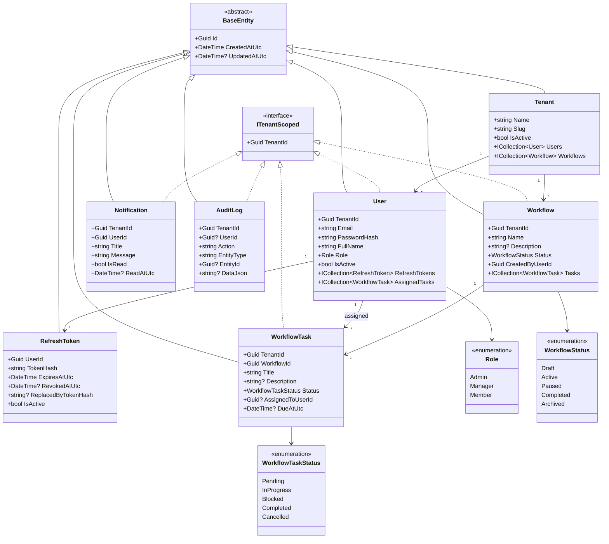

# Domain class diagram

Reflects `backend/src/NexaFlow.Domain/Entities` and `Enums` as actually implemented.

```mermaid
classDiagram
    class BaseEntity {
        <<abstract>>
        +Guid Id
        +DateTime CreatedAtUtc
        +DateTime? UpdatedAtUtc
    }

    class ITenantScoped {
        <<interface>>
        +Guid TenantId
    }

    class Tenant {
        +string Name
        +string Slug
        +bool IsActive
        +ICollection~User~ Users
        +ICollection~Workflow~ Workflows
    }

    class User {
        +Guid TenantId
        +string Email
        +string PasswordHash
        +string FullName
        +Role Role
        +bool IsActive
        +ICollection~RefreshToken~ RefreshTokens
        +ICollection~WorkflowTask~ AssignedTasks
    }

    class RefreshToken {
        +Guid UserId
        +string TokenHash
        +DateTime ExpiresAtUtc
        +DateTime? RevokedAtUtc
        +string? ReplacedByTokenHash
        +bool IsActive
    }

    class Workflow {
        +Guid TenantId
        +string Name
        +string? Description
        +WorkflowStatus Status
        +Guid CreatedByUserId
        +ICollection~WorkflowTask~ Tasks
    }

    class WorkflowTask {
        +Guid TenantId
        +Guid WorkflowId
        +string Title
        +string? Description
        +WorkflowTaskStatus Status
        +Guid? AssignedToUserId
        +DateTime? DueAtUtc
    }

    class Notification {
        +Guid TenantId
        +Guid UserId
        +string Title
        +string Message
        +bool IsRead
        +DateTime? ReadAtUtc
    }

    class AuditLog {
        +Guid TenantId
        +Guid? UserId
        +string Action
        +string EntityType
        +Guid? EntityId
        +string? DataJson
    }

    class Role {
        <<enumeration>>
        Admin
        Manager
        Member
    }

    class WorkflowStatus {
        <<enumeration>>
        Draft
        Active
        Paused
        Completed
        Archived
    }

    class WorkflowTaskStatus {
        <<enumeration>>
        Pending
        InProgress
        Blocked
        Completed
        Cancelled
    }

    BaseEntity <|-- Tenant
    BaseEntity <|-- User
    BaseEntity <|-- RefreshToken
    BaseEntity <|-- Workflow
    BaseEntity <|-- WorkflowTask
    BaseEntity <|-- Notification
    BaseEntity <|-- AuditLog

    ITenantScoped <|.. User
    ITenantScoped <|.. Workflow
    ITenantScoped <|.. WorkflowTask
    ITenantScoped <|.. Notification
    ITenantScoped <|.. AuditLog

    Tenant "1" --> "*" User
    Tenant "1" --> "*" Workflow
    User "1" --> "*" RefreshToken
    User "1" --> "*" WorkflowTask : assigned
    Workflow "1" --> "*" WorkflowTask
    User --> Role
    Workflow --> WorkflowStatus
    WorkflowTask --> WorkflowTaskStatus
```
