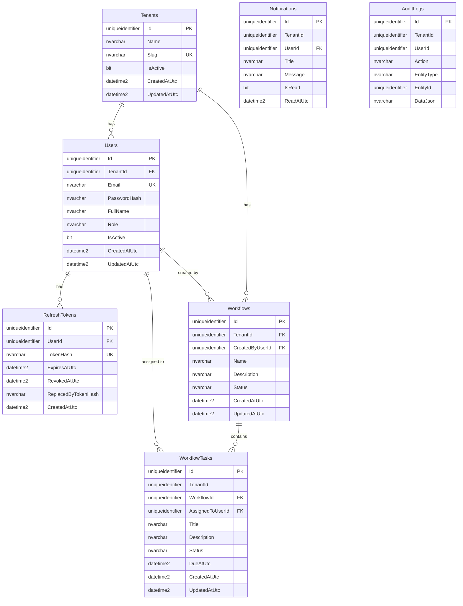

# Entity relationship diagram (SQL Server)

Generated from the actual EF Core migration
(`backend/src/NexaFlow.Infrastructure/Migrations/*_InitialCreate.cs`).

Notes:

- `WorkflowTasks.WorkflowId → Workflows` is `ON DELETE NO ACTION` (not cascade) —
  SQL Server rejects the cascade path that would otherwise fan back in through
  `Tenants → Users → WorkflowTasks.AssignedToUserId`. `WorkflowService.DeleteAsync`
  deletes a workflow's tasks explicitly before deleting the workflow itself.
- `WorkflowTasks.AssignedToUserId → Users` is `ON DELETE SET NULL`.
- `Users.Email` and `RefreshTokens.TokenHash` are unique indexes — email is globally
  unique across tenants (see [ADR-003](adr/003-auth-strategy.md)).
- `Notifications` and `AuditLogs` exist in the schema but nothing writes to them yet
  (Phase 2 — see [ADR-002](adr/002-messaging-choice.md)).
