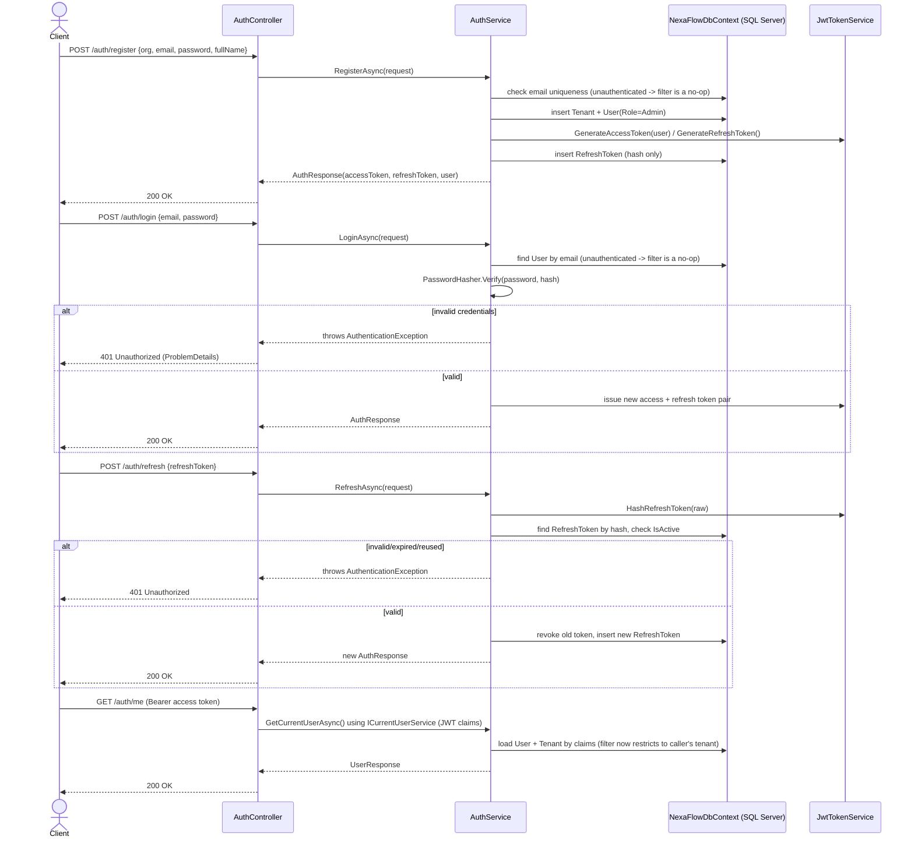

# Auth flow (implemented)

Register → Login → Refresh → Me, as implemented in `AuthController` / `AuthService` and
exercised by the xUnit v3 suite and a manual smoke test against SQL Server LocalDB.

