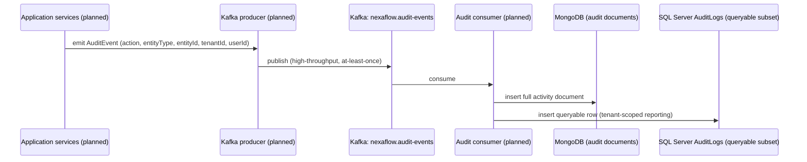

# Kafka audit stream (planned, Phase 2)

**Not implemented.** The `AuditLogs` SQL Server table exists in the schema (see
[ERD](../erd.md)) but nothing writes to it, and `NexaFlow.Messaging` has no Kafka producer
today — only config classes (`KafkaOptions`) bound from configuration. This diagram
documents the intended flow once audit events are actually raised and a consumer persists
them into MongoDB. See [ADR-001](../adr/001-database-strategy.md) and
[ADR-002](../adr/002-messaging-choice.md).

