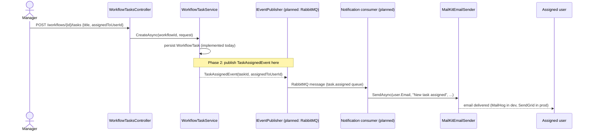

# Task assignment → notification (planned, Phase 2)

**Not implemented.** `WorkflowTaskService.CreateAsync`/`UpdateAsync` persist the task today
and stop there — no event is published. This diagram documents the intended Phase 2 flow
once `NexaFlow.Messaging`'s `IEventPublisher` gets a real RabbitMQ implementation (it's
currently `NoOpEventPublisher`) and `NexaFlow.Notifications`'s `MailKitEmailSender` gets
wired up to consume it. See [ADR-002](../adr/002-messaging-choice.md).

